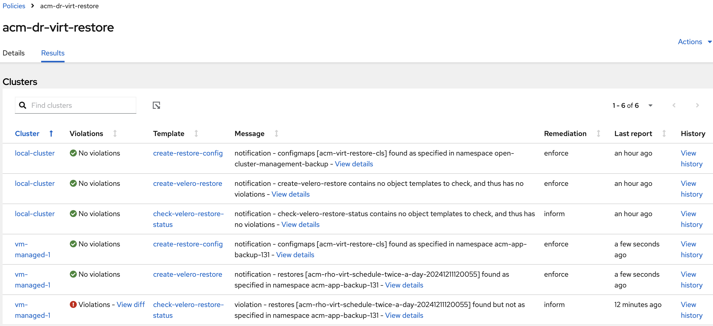

# ACM RH OV ( RedHat OpenShift Virtualization ) backup and restore using OADP and ACM Policies

Backup and restore virtualmachines.kubevirt.io resources on OpenShift hub or OpenShift managed clusters, using OADP. 

Supports the following backup and restore storage options:
- Container Storage Interface (CSI) backups
- Container Storage Interface (CSI) backups with DataMover

The following storage options are excluded:
- File system backup and restore
- Volume snapshot backups and restores

------

- [List of PolicySets](#list-of-policysets)
- [List of Policies](#list-of-policies)
  - [Install Policy](#acm-dr-virt-install-policy)
  - [Backup Policy](#acm-dr-virt-backup-policy)
  - [Restore Policy](#acm-dr-virt-restore-policy)
- [Scenario](#scenario)
  - [acm-virt-config ConfigMap](#configmap-set-by-using-the-managedcluster-acm-virt-config-label)
- [Backup Schedules](#backup-schedules)

## List of PolicySets 

PolicySet   | Description 
-------------------------------------------| ----------- 
[acm-dr-virt-backup-policyset](./policy-sets/acm-dr-vir-policysets.yaml)   | This PolicySet groups policies used to install OADP and backup  kubevirt.io.VirtualMachine resources with a `cluster.open-cluster-management.io/backup-vm: schedule_cron_name` label. These are [acm-dr-virt-install](./policies/acm-dr-virt-install.yaml)  and [acm-dr-virt-backup](./policies/acm-dr-virt-backup.yaml).
[acm-dr-virt-restore-policyset](./policy-sets/acm-dr-vir-policysets.yaml)   |  This PolicySet groups the policies used to install OADP and restore kubevirt.io.VirtualMachine resources by UID. These are [acm-dr-virt-install](./policies/acm-dr-virt-install.yaml) and [acm-dr-virt-restore](./policies/acm-dr-virt-restore.yaml).


## List of Policies 

Policy      | Description 
-------------------------------------------| ----------- 
[acm-dr-virt-install](./policies/acm-dr-virt-install.yaml)                       | Installs OADP and configures the DataProtectionApplication resource on the cluster where this policy is placed. If the cluster is a hub cluster, it will just validate that OADP is installed in the open-cluster-management-backup namespace and validates that the DataProtectionApplication exists and has the required configuration; it will not attempt to install OADP or create the DataProtectionApplication resource -  this is because on the hub OADP should be installed by the backup chart using the MCH backup option and you are expected to configure DataProtectionApplication when you enable this backup opion.
[acm-dr-virt-backup](./policies/acm-dr-virt-backup.yaml)                         | Backup kubevirt.io.VirtualMachine resources with a `cluster.open-cluster-management.io/backup-vm: schedule_cron_name` label. The policy is placed on any cluster, including hub cluster, if the ManagedCluster resource has a 'acm-virt-config' label. The value for this label should be a configMap you should create on the hub, in the same namespace with this policyset. This ConfigMap is required and defines the Schedule or Restore options. For samples see [acm-virt-config-14](./acm-virt-config-14.yaml). The `schedule_cron_name` must be a valid property defind by the `schedule-cron.yaml`, which is a ConfigMap created by the user under the same namespace as the policySet; the name of this ConfigMap should match the `schedule_hub_config_name` property from the main `acm-virt-config` ConfigMap.
[acm-dr-virt-restore](./policies/acm-dr-virt-restore.yaml)                        | Restores kubevirt.io.VirtualMachine resources by UID. The policy creates a velero Restore if the `acm-virt-config` ConfigMap defines a `restore_hub_config_name` ConfigMap with a non empty `restoreName` property. The policy is placed on any cluster, including hub cluster, if the ManagedCluster resource has a 'acm-virt-config' label. For samples see the `restore_hub_config_name` property from the [acm-virt-config-14](./acm-virt-config-14.yaml) and the corresponding [restore-config.yaml](./restore-config.yaml).


Run `oc apply -k virt ` to install all policies.


## ConfigMap set by using the ManagedCluster acm-virt-config label

  1. The Policies use the `acm-virt-config13.yaml` ConfigMap ( in the documentation we refer to `acm-virt-config13.yaml` but the name is defined by the ManagedCluster `acm-virt-config` label) to read the user configuration, such as OADP version to be installed, namespace name for the OADP version, backup storage location, velero secret, backup schedule cron job ConfigMap.
  2. The `acm-dr-virt-install` Policy copies over from the hub to the managed cluster:
    - the velero secret `hub-secret` and store it under a Secret with a name as defined by the `credentials_name` ConfigMap value. The user should have created in the Policy namespace a Secret with a name as defined by the `credentials_hub_secret_name` propoerty.
    - the configmap `acm-virt-config13.yaml`. The user should have created a ConfigMap in the Policy namespace with a name as defined by the ManagedCluster `acm-virt-config` label.
    - the cron schedule ConfigMap defined by the `schedule_hub_config_name` property. The policy checks if the user has created a configmap on the hub cluster with the name as defined by the `schedule_hub_config_name` property and shows a violation if missing. This ConfigMap contains all cron jobs a VM can use when defining a backup schedule. See [schedule-cron.yaml](schedule-cron.yaml) as an example. 
    The user should create a ConfigMap set values such as : `daily_8am`: `0 8 * * *`.  Each vm that wants to be backed up should add a label in this format : `cluster.open-cluster-management.io/backup-vm: twice_a_day`, where `twice_a_day` is a valid cron job name defined in the ConfigMap. 

## acm-dr-virt-install Policy

 The [`acm-dr-virt-install`](./policies/acm-dr-virt-install.yaml) Policy installs, if not already installed, OADP at specified version and creates the DPA resource using the `acm-virt-config13.yaml` ConfigMap `dpa_spec` property (updates DPA is already created). If the vm runs on the hub, so the Policy is placed on the hub, the `acm-dr-virt-install` Policy just checks if OADP is installed and DPA created.

 When uninstalled or disabled, it deletes all resources created directly by the Policy.


## acm-dr-virt-backup Policy

The [`acm-dr-virt-backup`](./policies/acm-dr-virt-backup.yaml) Policy backs up all vms with a `cluster.open-cluster-management.io/backup-vm`  label:

```yaml
apiVersion: kubevirt.io/v1
kind: VirtualMachine
metadata:
  name: vm2
  namespace: default
  labels:
    cluster.open-cluster-management.io/backup-vm: twice_a_day
```

The [`acm-dr-virt-backup`](./policies/acm-dr-virt-backup.yaml) Policy is used to backup one or more vms on the cluster where is placed. It depends on the `acm-dr-virt-install` Policy to setup and configure OADP and DPA and is not enabled until the `acm-dr-virt-install` Policy has no violations.

- The Policy creates a velero `Schedule` using the `acm-virt-config13.yaml` ConfigMap settings. It finds all VM's resources running on the cluster with a `cluster.open-cluster-management.io/backup-vm: cron_job_name` label, where `cron_job_name` is the name of the cron schedule used to backup this vm. The `cron_job_name` should be a valid property, defined by the [schedule-cron.yaml](schedule-cron.yaml) ConfigMap.

It creates a velero `Schedule` for each cron job name. All VirtualMachine are being backed up using one schedule per cron job. The velero `Schedule` name is `acm-rho-virt-schedule-<cron-job-name>`. 
Which means, if you want group vms in the same backup, on the same cluster, you need to use the same cron schedule name for all vms.

The generated backup includes all vms and all related resources, PVCs. See below an example of a Schedule with 3 VMs found.

- The Policy checks the status of the velero Backup and DataUpload resources and reports on violations.

- When uninstalled or disabled, it deletes all resources created directly by the Policy.

<b>Note:</b>
If the cluster where the VM's are running is the hub cluster then 
- the OADP ns is fixed to `open-cluster-management-backup` since this is the namespace where OADP is installed when the hub backup is enabled.
- the OADP is not installed by the Policy, it waits for the backup operator to be enabled and to install the OADP as per ACM version
- DPA or Velero secret resource are not created by the Policy, the Policy just informs on missing resources. The Policy will update the DPA with the OADP required config in order to backup the VM data but leaves the other settings unchanged.
- The VM schedule is not created unless there is an ACM hub BackupSchedule running.

Velero schedule sample, with 3 virtualmachines.kubevirt.io resources found on the managed cluster, `vm-1` in `vm-1-ns`, `vm-2` and `vm-3` in `default`:

```yaml
apiVersion: kubevirt.io/v1
kind: VirtualMachine
metadata:
  name: vm1
  namespace: vm1-ns
  uid: vm1uid
  labels:
    cluster.open-cluster-management.io/backup-vm: twice_a_day
```

```yaml
apiVersion: kubevirt.io/v1
kind: VirtualMachine
metadata:
  name: vm2
  namespace: default
  uid: vm2uid
  labels:
    cluster.open-cluster-management.io/backup-vm: twice_a_day
```

```yaml
apiVersion: kubevirt.io/v1
kind: VirtualMachine
metadata:
  name: vm3
  namespace: default
  uid: vm3uid
  labels:
    cluster.open-cluster-management.io/backup-vm: daily_8am
```

```yaml
apiVersion: velero.io/v1
kind: Schedule
metadata:
  name: acm-rho-virt-schedule-twice-a-day
  namespace: oadp-ns
  annotations:
   vm1uid: default--vm1
   vm2uid: default--vm2
  labels:
    cluster.open-cluster-management.io/backup-cluster: thisclusterid
    cluster.open-cluster-management.io/backup-schedule-type: kubevirt  
spec:
  paused: false
  schedule: 0 */12 * * *
  skipImmediately: false
  template:
    defaultVolumesToFsBackup: false
    includeClusterResources: true
    includedNamespaces:
      - vm-1-ns
      - default
    orLabelSelectors:
      - matchExpressions:
          - key: app
            operator: In
            values:
              - vm-1
              - vm-2
      - matchExpressions:
          - key: kubevirt.io/domain
            operator: In
            values:
              - vm-1
              - vm-2
    snapshotMoveData: true
    ttl: 24h
```

```yaml
apiVersion: velero.io/v1
kind: Schedule
metadata:
  name: acm-rho-virt-schedule-daily-8am
  namespace: oadp-ns
  annotations:
   vm3uid: default--vm3
  labels:
    cluster.open-cluster-management.io/backup-cluster: thisclusterid
    cluster.open-cluster-management.io/backup-schedule-type: kubevirt  
spec:
  paused: false
  schedule: 0 8 * * *
  skipImmediately: false
  template:
    defaultVolumesToFsBackup: false
    includeClusterResources: true
    includedNamespaces:
      - default
    orLabelSelectors:
      - matchExpressions:
          - key: app
            operator: In
            values:
              - vm-3
      - matchExpressions:
          - key: kubevirt.io/domain
            operator: In
            values:
              - vm-3
    snapshotMoveData: true
    ttl: 24h
```


## acm-dr-virt-restore Policy

The [`acm-dr-virt-restore`](./policies/acm-dr-virt-restore.yaml) Policy restores one or more vms on the cluster where the policy is placed. It depends on the `acm-dr-virt-install` Policy to setup and configure OADP and DPA and is not enabled until the `acm-dr-virt-install` Policy has no violations.

Set `restoreName` in the restore-config.yaml to flag this as a no op for restore ( the policy doesn't try to restore anything ).

Use the `restore_hub_config_name` property to specify what vms to restore. 
The value of the `restore_hub_config_name` property should be the name of the ConfigMap defining the restore information. This ConfigMap must be created by the user on the hub, under the Policy namespace. See [restore-config](./restore-config.yaml) ConfigMap as a sample.

In this ConfigMap you define the name of the velero restore (`restoreName` property, for example `restoreName: "acm-restore-twice-a-day-20241208155210"`), the name of the backup to restore (`backupName` property, for example backupName: `acm-rho-virt-schedule-twice-a-day-20241208155210`) and the list of vms UIDs, space separated, that you want to restore ( `vmsUID` property, for example `vmsUID: "b0ed31e9-ee17-4a59-9aa5-76b15a10ee42 uid2"`).


To get the UID of the VM you want to restore, open up the velero Backup and look for the annotations section. Each VM that has been backed up by this velero Backup should have an annotation in this format : `UID: vmns--vmname`. So if you know the name and ns of the VM you want to restore, you find the vm UID by looking for the annotation with this value `vmns--vmname`. See an example below:

```yaml
apiVersion: velero.io/v1
kind: Backup
metadata:
  name: acm-rho-virt-schedule-daily-8am-20241209080052
  annotations:
    457622ca-ab0a-474e-a6a9-cb7caf4a0a8b: mysql-persistent--fedora-todolist
```





# Scenario

How this works:

## VMs running on managed clusters or hub

- The user wants to enable virt backup on a managed cluster `cls1`:
  1. The user creates a ConfigMap on the hub, in the namespace where the policy is installed - for example [acm-virt-config13.yaml](./acm-virt-config-13.yaml) (in this case the cluster is an OCP 4.12 so we install OADP 1.3 )
  2. The user creates a velero secret on the hub `hub-secret`, in the namespace where the policy is installed. This is the velero storage secret and it will be copied to the cluster by the install policy. The name of the secret should match the value defined in the [acm-virt-config13.yaml](./acm-virt-config-13.yaml) by the `credentials_name` property.
  3. The user creates on the hub a schedule config map [schedule-cron](./schedule-cron.yaml),  in the namespace where the policy is installed. This will be used by the backup policy when creating the velero schedules. The name of the ConfigMap should match the value defined in the [acm-virt-config13.yaml](./acm-virt-config-13.yaml) by the `schedule_hub_config_name` property.
  4. The user creates on the hub a config map [restore-config](./restore-config.yaml),  in the namespace where the policy is installed. This will be used by the restore policy when creating the velero restores. The name of the ConfigMap should match the value defined in the [acm-virt-config13.yaml](./acm-virt-config-13.yaml) by the `restore_hub_config_name` property. If no restore should be run, the value of the `restoreName` property in this ConfigMap should be empty.
  5. The user applies on ManagedCluster `cls` this label : `acm-virt-config=acm-virt-config-13` . This will result in the Policies being placed on this cluster. 

- As soon as the `acm-virt-config` label is set on the ManagedCluster `cls` resource, the `acm-virt-backup` policy is placed on the `cls` managed cluster.

The backup Policy looks for `kubevirt.io.VirtualMachine` on this cluster having a `cluster.open-cluster-management.io/backup-vm` label. 

<b>Note</b>:
If the vm that needs to be backed up is running on the hub, the Policy will assume the OADP namespace is fixed to `open-cluster-management-backup` and will not try to install OADP because this should be installed by the backup chart when the backup component is enabled on  the MCH resource.

## Backup schedules 

The `cluster.open-cluster-management.io/backup-vm` value represents the name of the cron job to be used by this vm. The list of valid cron jobs is defined by the user using the `schedule_hub_config_name` property on the `acm-virt-config` ConfigMap. This property points to a cronjob map, see [schedule-cron.yaml](schedule-cron.yaml) as an example. All VirtualMachine are being backed up using one schedule per cron job. The velero `Schedule` name is `acm-rho-virt-schedule-<cron-job-name>`. 
Which means, if you want group vms in the same backup, you need to use the same cron schedule name for all vms.

If you want to have 2 vms in separate backups, they have to use a different name for the cron name for their schedule, even if the actual cron job is the same. For example, to backup vm1 and vm2 every hour but use different backups, create 2 cron job properties in the [schedule-cron.yaml](schedule-cron.yaml) ConfigMap, `vm1_each_hour: 0 * 1 * *` and `vm2_each_hour: 0 * 1 * *`. Since the cron job names are different, ththe vms will be backed up by different velero schedules,`acm-rho-virt-schedule-vm1-each-hour` and `acm-rho-virt-schedule-vm2-each-hour`.